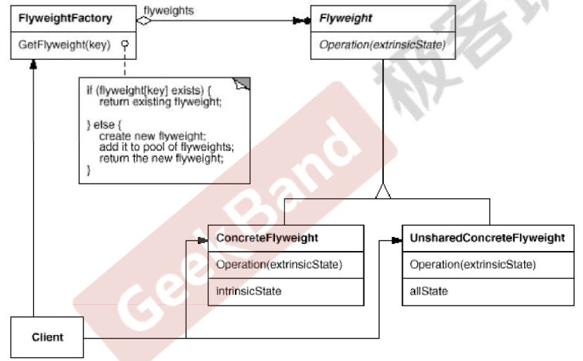

https://www.jetbrains.com/help/clion/2021.3/markdown.html#preview

# 对象性能模式
面向对象很好的解决了“抽象问题”，但不可避免的要付出一些代价，对于正常情况来讲，面向对象的成本可以
忽略不计。但某些情况下，面向对象所带来的成本必须谨慎处理
## 典型模式
Singleton
Flyweight

### Flyweight
#### 根因
在软件系统采用存粹的对象方案的问题在于大量细颗粒度的对象会很快的充斥在系统中
，从而带来很高的运行代价--主要指的时内存方面的代价。
如何避免大量细颗粒度对象问题的同时，让外部客户程序仍能够较透明的使用面向对象的方式来进行操作。
#### 方法
运用共享技术有效的支持大颗粒度的对象。

1、抽象享元角色（Flyweight）：通常是一个接口或抽象类，在抽象享元类中声明了
具体享元类公共的方法，这些方法可以向外界提供享元对象的内部数据（内部状
态），同时也可以通过这些方法来设置外部数据（外部状态）。
享元（Flyweight）模式中存在两种状态：
1）内部状态，即不会随着环境的改变而改变的可共享部分
2）外部状态，指随环境改变而改变的不可以共享的部分。享元模式的实现要
领就是区分应用中的这两种状态，并将外部状态外部化
2、共享的具体享元（Concrete Flyweight）角色 ：它实现了抽象享元类，称为享元
对象；在具体享元类中为内部状态提供了存储空间。通常我们可以结合单例模式
来设计具体享元类，为每一个具体享元类提供唯一的享元对象。
3、可非共享的具体享元（Unshared Flyweight)角色 ：并不是所有的抽象享元类的子类 
都需要被共享，不能被共享的子类可设计为非共享具体享元类；当需要一个非共享具
体享元类的对象时可以直接通过实例化创建
4、享元工厂（Flyweight Factory）角色 ：负责创建和管理享元角色。当客户对象请求
一个享元对象时，享元工厂检査系统中是否存在符合要求的享元对象，如果存在则
提供给客户；如果不存在的话，则创建一个新的享元对象。

### 总结
面向对象很好的解决了抽象性问题，但作为一个运行在机器中的程序实体，我们需要考虑对象的代价问题，flyweight
主要解决面向对象的代价问题，一般不触及面向对象的抽象性问题。
Flyweight采用对象共享的做法来降低系统中对象的个数，从而降低细颗粒度对象给系统带来的压力，在具体实现方面，
要注意对象状态的处理。
对象数量太大导致对象内存开销加大--什么样的数量才算大？需要仔细根据具体的应用情况进行评估，而不能凭空臆断。