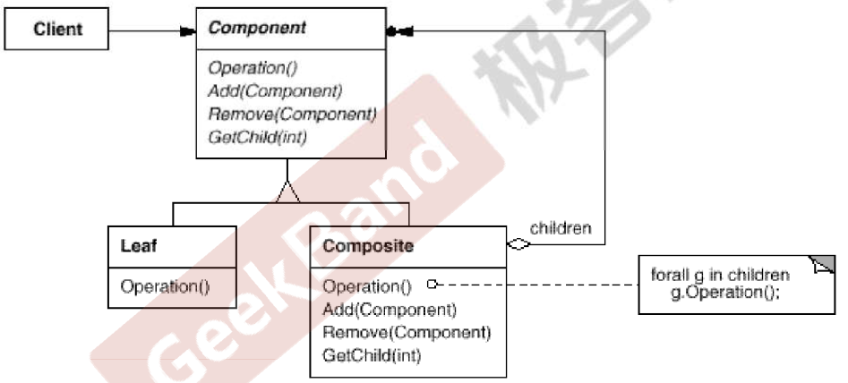

https://www.jetbrains.com/help/clion/2021.3/markdown.html#preview

# 数据结构模式
常常有一些组件在内部具有特定的数据结构，如果让客户依赖这些特定的数据结构，将极大的破坏组件的复用，这时候，将这些特定的数据结构封装在
内部，在外部提供同一的接口，来实现与特定数据结构无关的访问，是一种行之有效的方法。
## 典型模式
composite
interator
chain of responsibility

### Composite
#### 根因
客户代码过多地依赖于对象容器复杂的内部实现结构，对象容器内部实现结构(而非抽象结构)的变化 引起客户代码的频繁变化，带来了代码的维护性、扩展性等弊端。
如何将”客户代码与复杂的对象容器结构“解耦？让对象容器自己来实现自身的复杂结构，从而使得客户代码就像处理简单对象一样来处理复杂的对象容器？
#### 方法
将对象组合成树形结构以表示”部分-整体“的层次结构。Composite使得用户对单个对象和组合对象的使用具有一致性(稳定)。 

### 总结
Composite模式采用树性结构来实现普遍存在的对象容器，从而将”一对多“的关系转化为”一对一“的关系，使得客户代码可以一致地(复用)处理对象和对象容器， 无需关心处理的是单个的对象，还是组合的对象容器。
客户代码与纯粹的抽象接口——而非对象容器的内部实现结构——发生依赖，从而更能”应对变化“。
Composite模式在具体实现中，可以让父对象中的子对象反向追溯；如果父对象有频繁的遍历需求，可使用缓存技术来改善效率。
