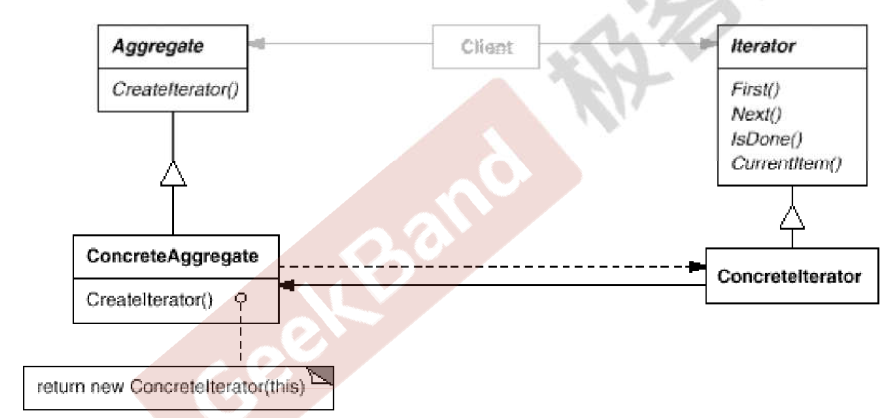

https://www.jetbrains.com/help/clion/2021.3/markdown.html#preview

# 数据结构模式
常常有一些组件在内部具有特定的数据结构，如果让客户依赖这些特定的数据结构，将极大的破坏组件的复用，这时候，将这些特定的数据结构封装在
内部，在外部提供同一的接口，来实现与特定数据结构无关的访问，是一种行之有效的方法。
## 典型模式
composite
interator
chain of responsibility

### Composite
#### 根因
在软件构建过程中，集合对象内部结构常常变化各异，但对于这些集合对象，我们希望在不暴露其内部
结构的同时，可以让外部用户代码透明的访问其中包含的元素，同时这种透明遍历也为同一种算法在多种
集合对象上进行操作提供了可能
使用面向对象技术将这种遍历机制抽象为迭代器对象为应对变化中的集合对象提供了一种优雅的方式。

#### 方法
提供一种访问顺序访问一个聚合对象中的各个元素，而不是暴露（稳定）该对象的内部表示 

### 总结
迭代抽象：访问一个聚合对象的内容而无需暴露他的内部接口
迭代多态：为遍历不同的集合结构提供一个统一的接口，从而支持同样的算法在不同的集合结构上
进行操作。
迭代器的健壮性考虑：遍历的同时更改迭代器所在的集合结构，会导致问题。