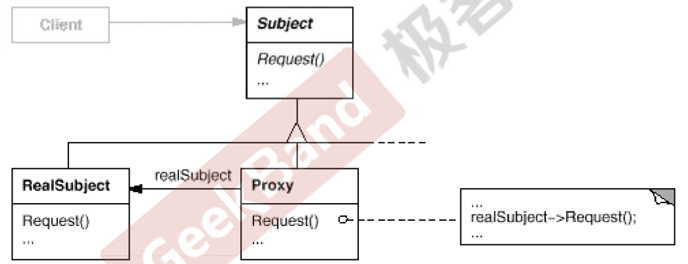

https://www.jetbrains.com/help/clion/2021.3/markdown.html#preview

# 接口隔离模式
在组件构建过程中，某些接口之间直接的依赖常常带来很多问题，甚至无法实现，采用添加一层间接（稳定）接口，
来隔离本来相互紧密关联的接口是一种常见的解决方案
## 典型模式
facade
proxy
adapter
mediator

### 代理模式

#### 根因
在面向对象系统中，有些对象由于某种原因(比如对象创建的开销很大，或者某些操作需要安全控制，或者需要进程外的访问等)， 直接访问会给使用者、或者系统结构带来很多麻烦。
如何在不失去透明操作对象的同事来管理/控制这些对象特有的复杂性？增加一层间接层是软件开发中常见的解决方式。
#### 方法
为其他对象提供一种代理以控制(隔离，使用接口)对这对象的访问。 

### 总结
增加一层间接层是软件系统中对许多复杂问题的一种常见解决方案，在面向对象系统中，直接使用某些对象会带来许多问题，作为间接层的
proxy对象便是解决这一问题的常用手段。
具体的proxy设计模式的实现方法，实现颗粒度都相差较大，有些可能对单个对象做细颗粒度控制，如copy-on-write技术，有些可能对
组件模块提供抽象代理层，在架构层次对对象做proxy。
Proxy并不一定要求保持接口完整的一致性，只要能够实现间接控制，有时候损及一些透明性是可以接受的