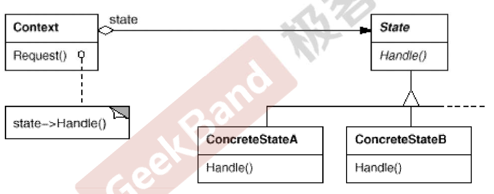

https://www.jetbrains.com/help/clion/2021.3/markdown.html#preview

# 状态变化模式
在组件构建过程中，某些对象的状态经常面临变化，如何对这些变化进行有效的管理？同时又维持高层模块的稳定
状态变化模式为这一问题提供了
## 典型模式
state
memento

### state
#### 根因
在软件构建过程中，某些对象的状态如果改变，其行为也会随之发生变化，比如文档处于只读状态，其支持的行为与支持读写状态的行为完全不同
如何在运行时根据对象的状态来透明的更改对象的行为？而不会因为对象的操作和状态转换之间引入紧耦合。

#### 方法
允许一个对象在其内部状态改变时改变他的行为，从而使得对象看起来似乎修改了其行为。

### 总结
state模式将所有与一个特定功能状态相关的行为都放入一个state的子类对象中，在对象状态切换时，切换相应的对象，但同时维持state的接口
这样实现了具体操作和状态转换之间的解耦。
为不同的状态引入不同的对象使得状态转换变得更加明确，而且可以保证不会出现状态不一致的情况，因为转换是原子性的，要么彻底转换，要么不转换。
如果state对象没有实例变量，那么各个上下文可以共享一个state对象，从而节省对象开销